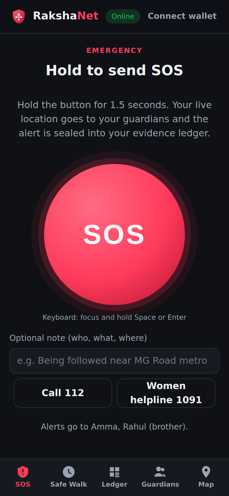
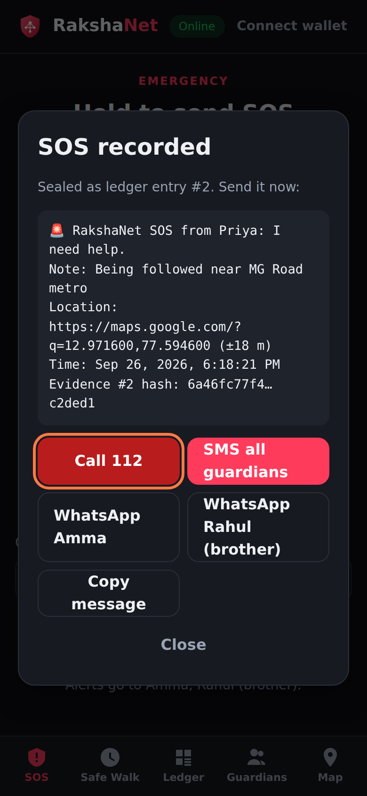
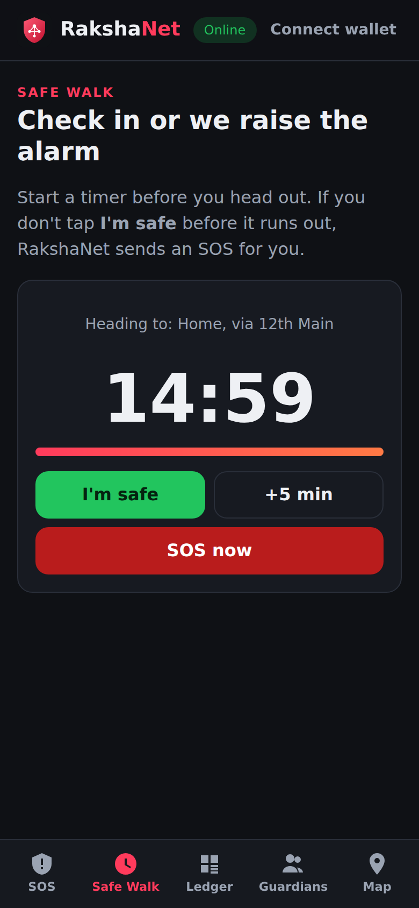
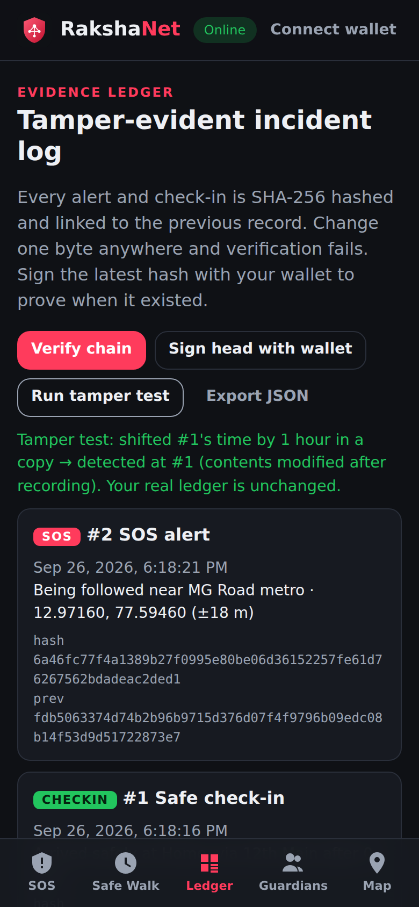

<p align="center"></p>

# RakshaNet

**Protection in seconds. Evidence nobody can quietly edit.**

RakshaNet ("raksha" means protection) is an installable, offline-first safety web app with three features:

- **Hold-to-SOS.** Hold for 1.5 seconds (no misfires) to capture your live GPS location and a note. The alert is ready to send by SMS to all your guardians, by WhatsApp, through the share sheet, or as a call to 112.
- **Safe Walk.** Set a timer for your trip. Tap *I'm safe* when you arrive. If you don't, RakshaNet fires an SOS for you.
- **Evidence Ledger.** Every alert and check-in is SHA-256 hashed and chained to the one before it, so any edit, deletion or reordering is detected. You can sign the latest hash with your wallet (EIP-1193 `personal_sign`) to prove when the evidence existed.

It also has a **Safety Map** that lists police stations and hospitals within 3 km, using OpenStreetMap data.

| SOS | Alert | Safe Walk | Ledger |
|---|---|---|---|
|  |  |  |  |

Demo video: [`docs/media/rakshanet-demo.mp4`](docs/media/rakshanet-demo.mp4). Pitch deck: [`docs/RakshaNet-Pitch-Deck.pptx`](docs/RakshaNet-Pitch-Deck.pptx).

## Run it

The app has no build step and no dependencies.

```bash
npm start      # serves on http://localhost:8080
npm test       # ledger unit tests (Node 20+)
```

To deploy, push the repo to any static host (Vercel, Netlify or GitHub Pages). Geolocation and the service worker need HTTPS.

## How it's built

| Area | Approach |
|---|---|
| App | Plain HTML, CSS and ES modules, about 40 KB of code. Hash-based routing. Mobile-first, with dark and light mode and support for reduced motion. |
| Offline | A service worker serves the app shell network-first with a cache fallback, so SOS, Safe Walk and the ledger work with no signal. |
| Ledger | [`lib/ledger.js`](lib/ledger.js): canonical JSON, WebCrypto SHA-256, `prevHash` links, and `verifyChain()` pinpoints the first broken record. Writes are queued so the chain can't fork. |
| Wallet | Any EIP-1193 wallet signs `RakshaNet evidence anchor / Head: <hash>`. The signature is itself recorded in the ledger. |
| Map | Leaflet is bundled in `vendor/` and loaded only when the Map tab opens. Nearby places come from the Overpass API. |
| Privacy | There is no server. Data stays in `localStorage` on your device until you choose to send an alert. |

## Project layout

```
index.html, styles.css, app.js   UI
lib/ledger.js                    hash-chained ledger (browser + Node)
test/ledger.test.js              unit tests
sw.js, manifest.webmanifest      PWA / offline
assets/                          logo (SVG, 512 and 1024 px PNG)
docs/                            registration kit, pitch deck, screenshots, demo video
vendor/leaflet/                  Leaflet 1.9.4 (BSD-2-Clause)
```

## Hackathon

Built for Async'26. Copy-paste answers for the registration form are in [`docs/REGISTRATION.md`](docs/REGISTRATION.md).
