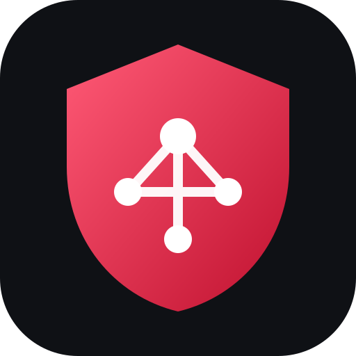
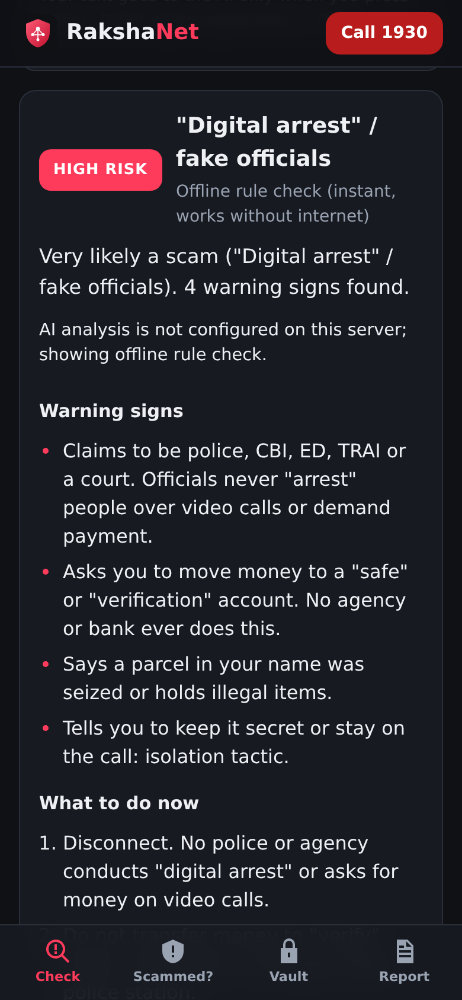
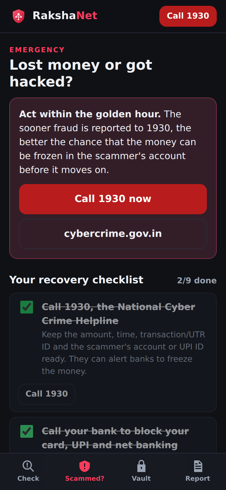
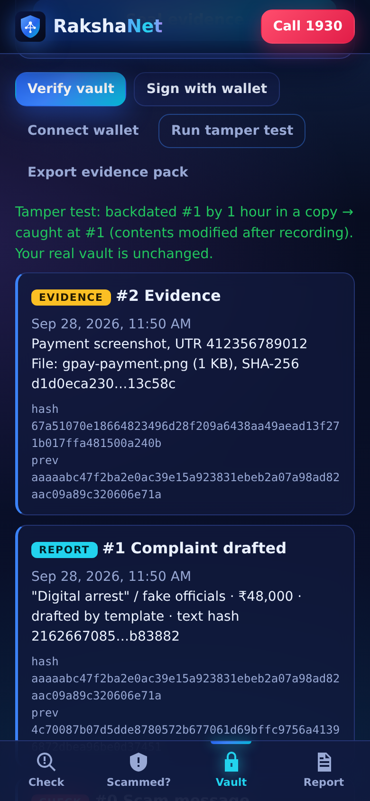
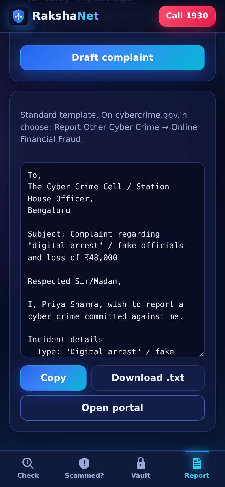

<p align="center"></p>

# RakshaNet

**Your shield against cyber fraud.** Check it. Act fast. Keep proof. Report.

RakshaNet ("raksha" means protection) is an offline-first web app that helps people in India before, during and after a cyber scam.

- **Scam Check.** Paste any SMS, WhatsApp message, email, link, UPI request or call script, or **upload a screenshot**. With an AI key the AI reads the screenshot; without one, the text is read on the device (Tesseract.js). The offline rule engine gives an instant verdict. Then an AI (**Gemini**, free, or **Claude**) adds its analysis: the risk level, the scam type, the specific red flags and what to do next.
- **Scammed?** A golden-hour emergency guide. It starts with calling **1930**, then walks through blocking your bank and UPI, securing your accounts, warning your contacts and reporting, with a checklist that remembers your progress.
- **Evidence Vault.** Scam messages, screenshots and UTR IDs are fingerprinted with SHA-256 and hash-chained, so any edit, deletion or reordering is detected. You can sign the vault with your wallet to timestamp it, and export a JSON evidence pack.
- **Report.** The AI drafts a complaint ready for **cybercrime.gov.in**, using your facts, the suspect IDs and your vault evidence hashes. There's an offline template fallback.

| Check | Scammed? | Vault | Report |
|---|---|---|---|
|  |  |  |  |

Demo video: [`docs/media/rakshanet-demo.mp4`](docs/media/rakshanet-demo.mp4). Pitch deck: [`docs/RakshaNet-Pitch-Deck.pptx`](docs/RakshaNet-Pitch-Deck.pptx). The screenshots and video show offline mode.

## Run it

```bash
npm install
GEMINI_API_KEY=... npm start        # http://localhost:8080, AI via Gemini (free tier)
ANTHROPIC_API_KEY=... npm start     # AI via Claude
npm start                           # offline rules + template only
npm test                            # 22 tests: rules, ledger, Claude + Gemini integration (mocked)
```

**Deploy (Vercel):** import the repo, add **one** AI key as an environment variable, and deploy. The `api/*.js` files become serverless functions. On any static host without functions, the app still works in offline mode.

| Variable | Purpose |
|---|---|
| `GEMINI_API_KEY` | Free key from aistudio.google.com. Uses `gemini-flash-latest`; override with `GEMINI_MODEL`. |
| `ANTHROPIC_API_KEY` | Claude (paid). Uses `claude-opus-5`; override with `RAKSHANET_MODEL`. |
| `RAKSHANET_PROVIDER` | Optional: `gemini` or `anthropic` when both keys are set. Otherwise Claude wins. |

On Gemini's free tier, Google may use what users send to improve its products. The app already tells users not to paste passwords or OTPs.

## How it's built

| Area | Approach |
|---|---|
| Rule engine | [`lib/scam-rules.js`](lib/scam-rules.js): 20+ weighted patterns for Indian frauds, including digital arrest, UPI collect/QR, fake KYC, task, investment, sextortion and remote-access scams. Link forensics catch look-alike bank domains, punycode, shorteners, IP hosts, risky TLDs and `@` tricks. It extracts UPI IDs, phones, links, emails and amounts. It runs in the browser and on the server. |
| AI analysis | [`lib/assistant.js`](lib/assistant.js) + [`api/analyze.js`](api/analyze.js) use the official Google GenAI SDK (Gemini) or Anthropic SDK (Claude) with a JSON-schema structured output. Pasted text is fenced in `<received>` tags as untrusted data. On Claude, server-side refusal fallback is enabled. Any failure, block or truncation returns the rule-engine result. |
| AI complaint | [`api/complaint.js`](api/complaint.js): facts-only drafting with `<placeholders>` for anything missing. [`lib/complaint.js`](lib/complaint.js) is the offline template. |
| Evidence Vault | [`lib/ledger.js`](lib/ledger.js): canonical JSON, WebCrypto SHA-256 and `prevHash` links. `verifyChain()` pinpoints the first broken record. Files are hashed locally, never uploaded. EIP-1193 `personal_sign` anchors the vault head. |
| App | Plain HTML, CSS and ES modules as an installable PWA, with no framework. The service worker makes the rules, checklist and vault work offline. |
| Privacy | No accounts and no database. Data lives in `localStorage` on your device. Text goes to the AI only when you press **Check it** or **Draft complaint**. |

## Project layout

```
index.html, styles.css, app.js     UI (Check, Scammed?, Vault, Report)
lib/scam-rules.js                  offline scam + link analysis (browser + server)
lib/ledger.js                      hash-chained evidence vault
lib/complaint.js                   complaint template
lib/assistant.js                   Gemini / Claude integration (server only)
api/analyze.js, api/complaint.js   serverless endpoints (Vercel)
server.js                          local dev server (static + /api)
test/                              node:test suites
docs/                              registration kit, pitch deck, screenshots, demo video
```

## Hackathon

Built for Async'26. Copy-paste answers for the registration form are in [`docs/REGISTRATION.md`](docs/REGISTRATION.md).

In an emergency, call **1930** (National Cyber Crime Helpline) or report at **cybercrime.gov.in**.
